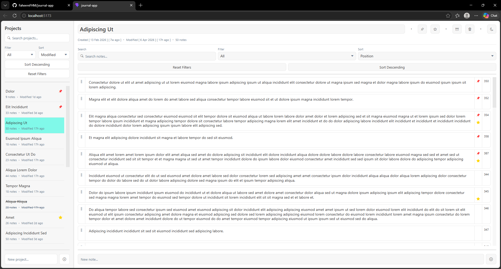
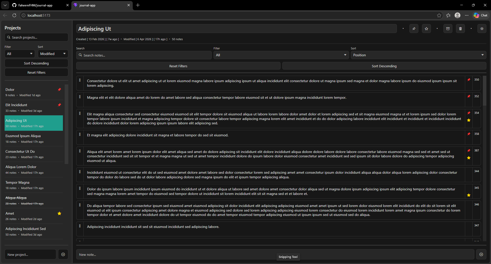

# Journal App

## Description
A web app for journaling and note-taking, built as a learning project using React (Vite) and json-server.

## Features
- Create projects, within which one can create notes.
- Edit, delete, star and pin both projects and notes.
- Archive and recover deleted projects.
- Theme switching.

## Samples

### Light Theme


### Dark Theme


## Future Updates
- Reordering notes.
- Note types (dividers, headings, bold, underline, cross-through, italics).
- Switch from json-server prototype to MongoDB.

## Installation

### Prerequisites
Please ensure you have the following installed on your system:

- Node.js (tested with v24.14.0)
- npm

---

### 1. Clone the Repository
```bash
git clone https://github.com/FaheemFHM/journal-app.git
cd journal-app
```

---

### 2. Install Dependencies
```bash
npm install
```

---

### 3. Run Mock Backend
This project uses json-server as a mock API:

```bash
npx json-server --watch db.json --port 5000
```

The API will run at:
http://localhost:5000

---

### 4. Start Frontend
In a new terminal, run:

```bash
npm run dev
```

The app will run at:
http://localhost:5173

---

### Notes
- Ensure both the backend and frontend are running at the same time.
- If a port is already in use, you may need to change it.
